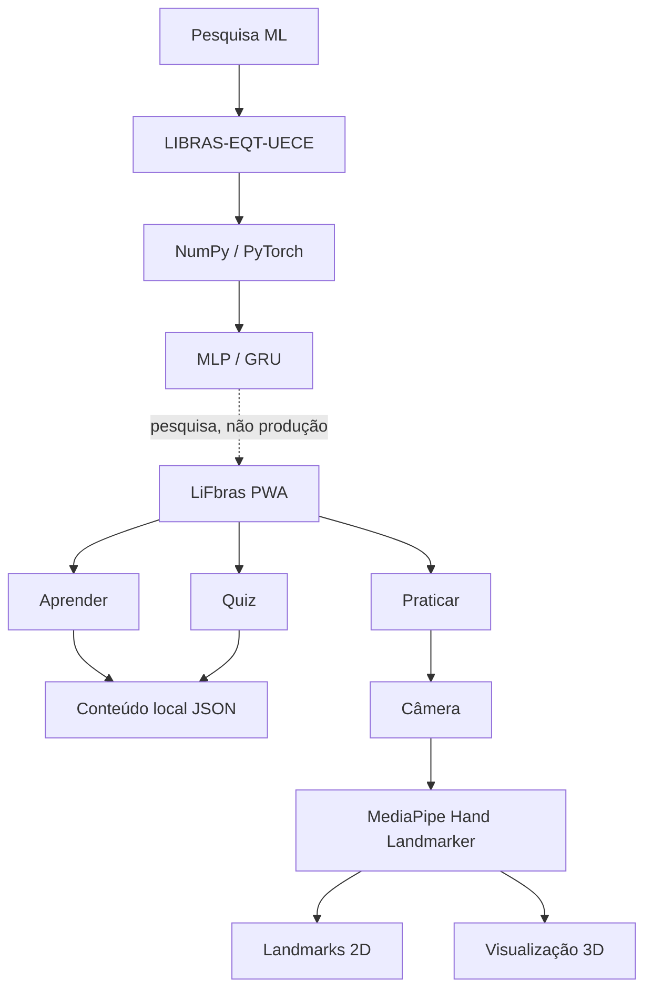

<div align="center">

# LiFbras

### Aprendizado de Libras com tecnologia, visão computacional e acessibilidade

Uma aplicação web educacional desenvolvida para apoiar o aprendizado introdutório da **Língua Brasileira de Sinais (Libras)** por meio de conteúdo visual, prática interativa e exercícios.

**Cauê Pereira · Pedro Cajazeiras**

<br>


</div>

---

## Sobre o LiFbras

O **LiFbras** nasceu como um projeto educacional voltado ao ensino introdutório de Libras, combinando desenvolvimento web, acessibilidade e visão computacional.

A aplicação foi construída com três experiências principais:

- **Aprender:** conteúdo visual organizado por categorias.
- **Praticar:** câmera com detecção das mãos pelo MediaPipe e visualização dos landmarks em 2D e 3D.
- **Quiz:** exercícios gerados a partir do próprio conteúdo educacional da aplicação.

O objetivo do projeto não é substituir professores, intérpretes ou materiais especializados em Libras, mas oferecer uma ferramenta complementar de estudo e experimentação.

---

## Funcionalidades

### Aprender

Conteúdo educacional estruturado para consulta e estudo, incluindo tópicos como:

- Alfabeto Manual;
- Saudações;
- Numerais;
- conceitos introdutórios de Libras.

As informações utilizadas possuem referências educacionais documentadas no projeto.

### Practice Lab

A área **Praticar** utiliza a câmera do dispositivo para mostrar como um sistema de visão computacional interpreta as mãos.

O laboratório possui:

- detecção de até duas mãos;
- 21 landmarks por mão;
- conexão visual entre os pontos;
- identificação de mão esquerda e direita;
- visualização espacial dos landmarks;
- modo 3D interativo;
- rotação manual da visualização; LiFbras

LiFbras is a small educational web app for learning and practicing Brazilian Sign Language (Libras). Its mobile-first MVP has three areas: **Aprender** (visual lessons by category), **Praticar** (camera-based landmark practice), and **Quiz** (simple exercises).

The stack is a React + Vite PWA, browser-side MediaPipe, and a Python FastAPI health API. Machine-learning work remains offline research and is not part of the product. Educational content uses local structured files. The MVP has no database or user accounts.

**Status:** Frontend application shell, initial handout-based learning content, local camera hand-landmark visualization, and a minimal FastAPI foundation are implemented. The Practice Lab does not classify or grade Libras signs.

## Frontend
 
```bash
cd frontend
npm install
npm run dev      # development server
npm run build    # production build
npm run lint     # oxlint check
```

Requires Node.js 20+.

## Backend

```bash
cd backend
python3 -m venv .venv
.venv/bin/python -m pip install -r requirements.txt
.venv/bin/uvicorn app.main:app --reload
```

The API health check is available at `http://localhost:8000/api/v1/saude`. The backend currently supports Python 3.10+, and local configuration can be copied from `.env.example` when environment variables need to be changed.

## Documentation

- [Architecture](docs/ARCHITECTURE.md)
- [Decisions](docs/DECISIONS.md)
- [Development and Deployment](docs/DEPLOYMENT.md)
- [UI References](docs/UI-REFERENCES.md)
- [UI Specification](docs/UI-SPEC.md)

- funcionamento responsivo em dispositivos móveis.

A imagem da câmera é processada no navegador.

O Practice Lab **não avalia se um sinal está certo ou errado**.

### Quiz

O Quiz utiliza o mesmo conteúdo estruturado da área Aprender.

O fluxo possui:

- cinco questões por rodada;
- alternativas;
- feedback após a resposta;
- resultado final;
- possibilidade de refazer o exercício;
- navegação para revisão do conteúdo.

Não há necessidade de conta, banco de dados, pontuação permanente ou ranking.

---

## Visão computacional

O LiFbras utiliza **MediaPipe Tasks Vision** para detecção das mãos diretamente no navegador.

Cada mão detectada é representada por:

```text
21 landmarks

cada landmark:
x
y
z
```

Com duas mãos:

```text
21 × 3 × 2
=
126 valores espaciais
```

Esses pontos podem ser utilizados para representar configuração, posição e movimento das mãos sem precisar enviar os quadros da câmera para um backend do LiFbras.

### Visualização 3D

O projeto também transforma os landmarks detectados em uma representação tridimensional interativa.

A implementação utiliza o próprio **Canvas**, sem necessidade de Three.js ou outros frameworks 3D adicionais.

```text
Câmera
   ↓
MediaPipe
   ↓
Landmarks
   ├── Visualização 2D
   └── Visualização 3D
```

---

## Pesquisa com Machine Learning

O repositório também contém uma etapa experimental de pesquisa utilizando **PyTorch** e o dataset **LIBRAS-EQT-UECE**.

Foram estudados:

- preparação de sequências de landmarks;
- normalização espacial;
- interpolação temporal;
- MLP;
- GRU;
- classificação de sequências;
- avaliação independente por informante;
- Leave-One-Person-Out;
- análise de generalização;
- PCA;
- contexto corporal por landmarks de pose.

Durante os experimentos, alguns modelos apresentaram resultados elevados em validação, mas o desempenho caiu significativamente para determinadas pessoas não vistas durante o treinamento.

Por esse motivo, a pesquisa concluiu que o modelo atual **não possui generalização suficiente para ser utilizado como reconhecedor de Libras na aplicação**.

O classificador experimental, portanto, não faz parte do runtime do MVP.

Essa decisão evita apresentar ao usuário previsões que ainda não possuem confiabilidade suficiente.

---

## Arquitetura do MVP



---

## Tecnologias

### Frontend

- React
- Vite
- React Router
- CSS
- Lucide
- MediaPipe Tasks Vision
- Vite PWA

### Visão computacional

- MediaPipe Hand Landmarker
- landmarks 3D das mãos
- Canvas
- `getUserMedia`

### Pesquisa de Machine Learning

- Python
- NumPy
- PyTorch
- scikit-learn

### Backend experimental

- FastAPI
- Uvicorn
- Pytest

O backend existe como fundação para pesquisa e futuras integrações, mas **não é necessário para executar o MVP atual**.

---

## Estrutura do projeto

```text
liFbras/
│
├── frontend/
│   ├── src/
│   ├── public/
│   ├── package.json
│   └── vercel.json
│
├── backend/
│   ├── app/
│   └── tests/
│
├── ml/
│   ├── preparação de dados
│   ├── modelos
│   ├── treinamento
│   └── diagnósticos
│
├── dados/
│   └── conteudo_libras.json
│
├── CREDITS.md
└── README.md
```

Datasets, checkpoints, documentos internos, arquivos de ambiente e demais artefatos locais não são distribuídos pelo repositório público.

---

## Executando localmente

### Requisitos

- Node.js 20+
- npm

Clone o projeto:

```bash
git clone https://github.com/ccauepereira/liFbras.git
cd liFbras
```

Entre no frontend:

```bash
cd frontend
```

Instale as dependências:

```bash
npm ci
```

Inicie o ambiente de desenvolvimento:

```bash
npm run dev
```

A aplicação ficará disponível, normalmente, em:

```text
http://localhost:5173
```

---

## Build de produção

```bash
npm run lint
npm run build
npm run preview
```

O resultado de produção é gerado em:

```text
frontend/dist/
```

---

## Uso da câmera

O navegador exige um **contexto seguro** para acesso à câmera.

Em desenvolvimento, utilize:

```text
localhost
```

Em produção, utilize:

```text
HTTPS
```

---

## PWA

O LiFbras foi desenvolvido como uma **Progressive Web App**.

Isso permite que navegadores compatíveis ofereçam instalação no computador ou celular.

O projeto possui:

- Web App Manifest;
- Service Worker;
- ícones próprios;
- cache da interface;
- conteúdo educacional local;
- layout responsivo.

A funcionalidade completa do Practice Lab pode depender do carregamento dos recursos externos utilizados pelo MediaPipe.

---

## Privacidade

Os quadros capturados pela câmera são processados localmente no navegador.

O LiFbras não envia para seus próprios servidores:

- imagens da câmera;
- vídeos;
- landmarks das mãos.

O MediaPipe utiliza recursos externos para carregar componentes como WASM e modelos de visão computacional e pode enviar métricas conforme sua própria política de privacidade.

Por isso, o projeto não declara que todo o funcionamento seja completamente offline ou sem comunicação com serviços externos.

---

## Limitações atuais

O LiFbras é um **MVP educacional e projeto acadêmico**.

Entre as limitações atuais estão:

- vocabulário educacional ainda reduzido;
- ausência de autenticação e persistência de progresso;
- prática sem correção automática dos sinais;
- dependência do MediaPipe para detecção das mãos;
- pesquisa de reconhecimento automático ainda sem generalização suficiente entre diferentes pessoas.

Essas limitações são mantidas explicitamente para evitar apresentar funcionalidades experimentais como sistemas confiáveis de tradução ou avaliação de Libras.

---

## Possíveis evoluções

Algumas linhas futuras estudadas para o LiFbras incluem:

- regionalismos da Libras;
- sinalário de tecnologia e ambiente acadêmico;
- visualização de sinais em 3D;
- comparação temporal de movimentos;
- busca por parâmetros linguísticos;
- ampliação do conteúdo educacional;
- novas pesquisas de reconhecimento entre diferentes sinalizadores.

---

## Créditos e fontes

As referências educacionais, bibliotecas e materiais reutilizados estão documentados em:

[CREDITS.md](CREDITS.md)

O dataset experimental **LIBRAS-EQT-UECE** e os checkpoints de treinamento não são distribuídos neste repositório.

---

## Autores

<table>
  <tr>
    <td align="center">
      <strong>Cauê Pereira</strong>
    </td>
    <td align="center">
      <strong>Pedro Cajazeiras</strong>
    </td>
  </tr>
  <tr>
    <td align="center">
      Desenvolvimento, engenharia e pesquisa
    </td>
    <td align="center">
      Desenvolvimento e projeto
    </td>
  </tr>
</table>

---

<div align="center">

**LiFbras — tecnologia aplicada ao aprendizado de Libras.**

Desenvolvido por **Cauê Pereira** e **Pedro Cajazeiras**.

</div>
